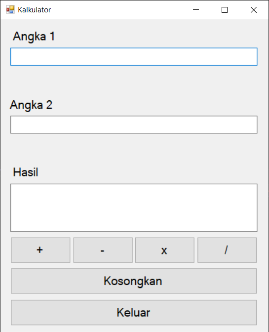
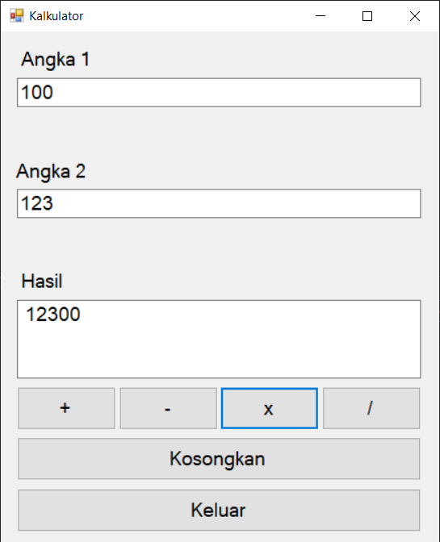
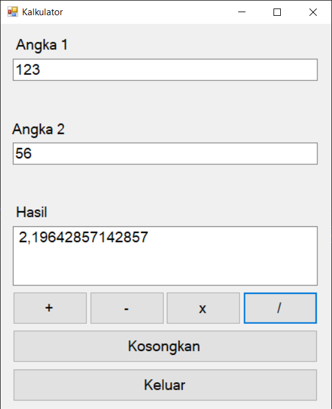

# Basic Calculator App (VB.NET WinForms)

Nov 18, 2021 | Built in 11th grade (Semester 1), this desktop calculator app helps me practice basic Windows Forms UI, button event handling, and simple arithmetic operations using Visual Basic .NET.

---

## Preview (Screenshots)

| Calculator | Multiplication | Distribution |
|---|---|---|
|  |  |  |

---

## Features

- Basic arithmetic operations (addition, subtraction, multiplication, division)
- Clear / reset input
- Simple WinForms-based UI
- Button click event handling

---

## Tech Stack

- **Language:** Visual Basic .NET (VB.NET)  
- **Build System:** Visual Studio Solution (.sln)  
- **UI:** Windows Forms (WinForms)  
- **Target Framework:** .NET Framework 4.7.2  

---

## Project Structure (High Level)

- `KalkulatorTugas.sln` - Visual Studio solution file
- `KalkulatorTugas/` - Main WinForms project
- `KalkulatorTugas/Form1.vb` - Main form logic (calculator behavior)
- `KalkulatorTugas/Form1.Designer.vb` - UI layout generated by WinForms designer
- `KalkulatorTugas/My Project/` - Application settings & resources
- `docs/` - Screenshots for README

---

## Getting Started

### Requirements
- Windows OS
- Visual Studio (recommended: a modern version)
- .NET Framework Developer Pack 4.7.2

### Run Locally
1. Clone the repository:
   ```bash
   git clone https://github.com/Aryosetowmn/desktopdev_kelas11semester1_port5.git
   ```
2. Open `KalkulatorTugas.sln` in **Visual Studio**
3. Restore / load the project (if prompted)
4. Build and Run (Start)

---

## Notes

This repository is intended for learning and portfolio demonstration.  
For real-world desktop apps, consider improving input validation, adding keyboard support, and separating UI logic from calculation logic for maintainability.

---

## Author

**Aryosetowmn**  
Repository: `Aryosetowmn/desktopdev_kelas11semester1_port5`
